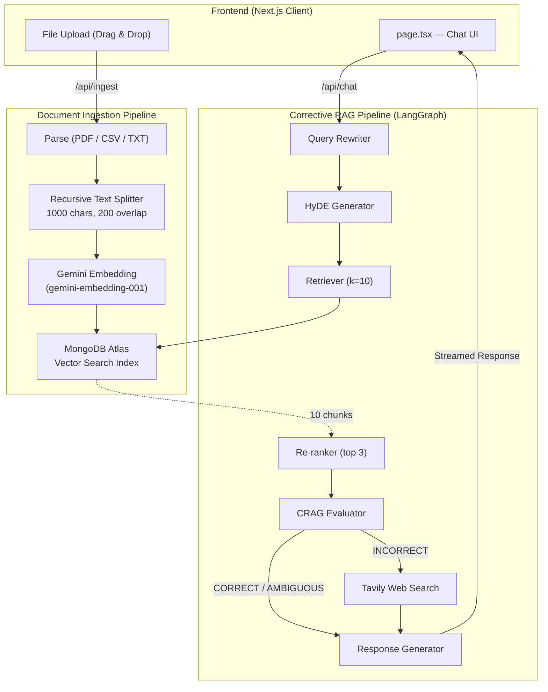
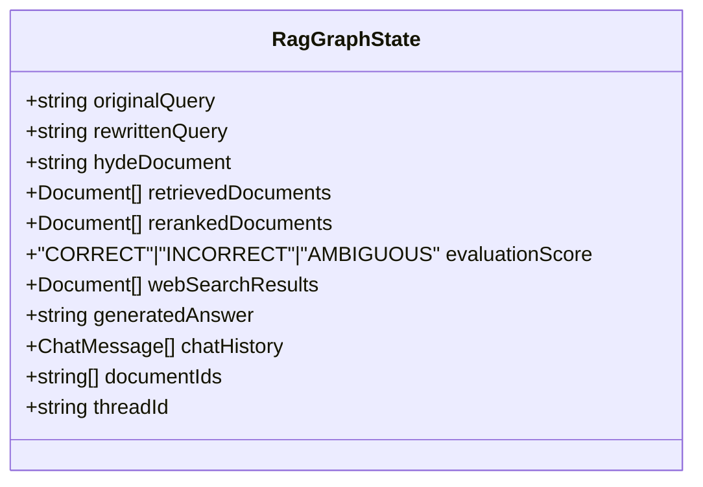
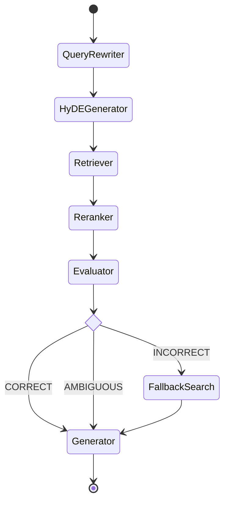
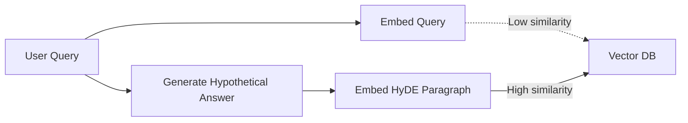
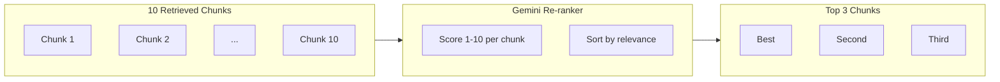
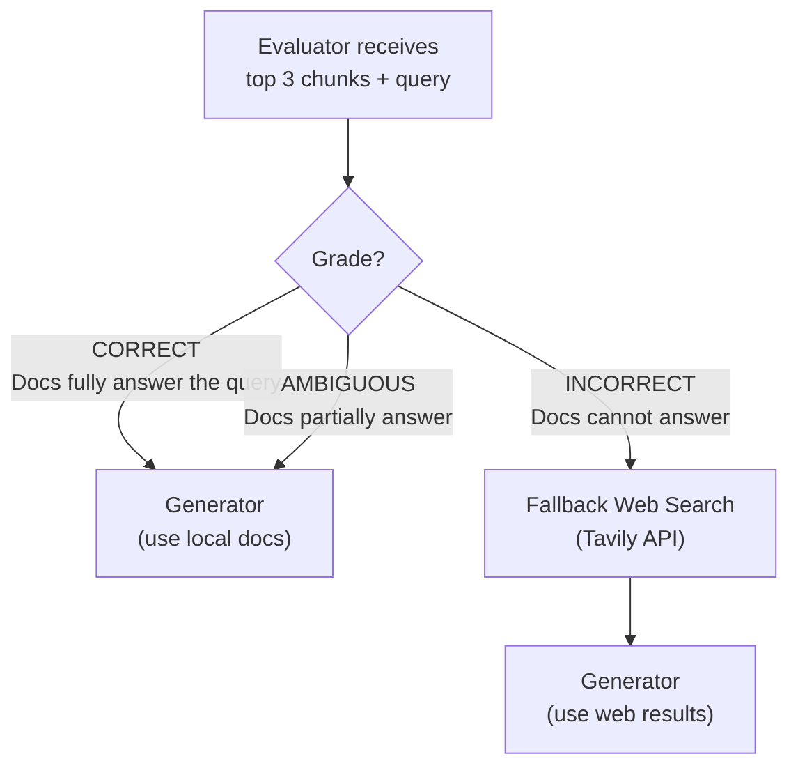
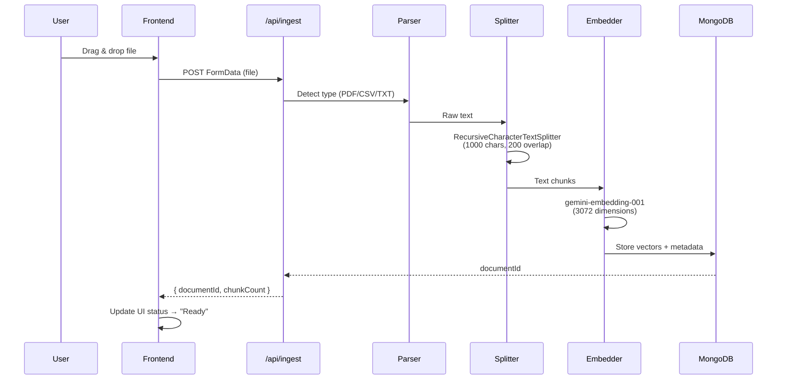

<div align="center">
  <h1>Kikandai — System Design Document</h1>
  <p><strong>Corrective RAG (CRAG) Architecture with LangGraph State Machine</strong></p>
</div>

<br/>

## 1. Design Philosophy

Kikandai is built on the principle that **retrieval quality determines generation quality**. Rather than blindly feeding retrieved chunks to an LLM, the system implements a multi-stage verification pipeline that actively evaluates, corrects, and optimizes the retrieval process before generating a response.

The architecture follows three core tenets:

| Tenet | Implementation |
|-------|---------------|
| **Never trust raw retrieval** | Every retrieved chunk passes through re-ranking and evaluation before reaching the generator |
| **Fail gracefully with correction** | When local documents lack the answer, the system self-corrects via web search |
| **Optimize the query, not just the answer** | Query rewriting and HyDE ensure the retrieval step receives the best possible input |

---

## 2. High-Level Architecture



---

## 3. The LangGraph State Machine

The heart of Kikandai is a **StateGraph** powered by `@langchain/langgraph`. Unlike a simple sequential chain, this is a compiled state machine with conditional branching, enabling the CRAG (Corrective Retrieval Augmented Generation) pattern.

### 3.1 State Schema

Every node in the graph reads from and writes to a shared state object:



### 3.2 Graph Topology



### 3.3 Checkpointing

The graph is compiled with a `MemorySaver` checkpointer. Each conversation session receives a unique `threadId` (generated via `crypto.randomUUID()` on the client), enabling multi-turn session persistence. The checkpointer stores intermediate state snapshots, allowing the graph to resume from any node if needed.

---

## 4. Node-by-Node Breakdown

### 4.1 Query Rewriter

| Property | Value |
|----------|-------|
| **File** | `src/app/lib/nodes/queryRewriter.ts` |
| **Model** | `gemini-3-flash-preview` |
| **Purpose** | Transforms conversational queries into keyword-rich, vector-search-optimized queries |

**Why it matters:** Users ask conversational questions like *"Can you tell me more about that?"*. A vector database cannot resolve pronouns or implicit context. The rewriter expands abbreviations, removes filler words, and adds implicit context to produce a clean search query.

**Input → Output:**
```
"Can you tell me about that reaction we discussed?" 
    → "SN1 nucleophilic substitution reaction mechanism carbocation intermediate"
```

---

### 4.2 HyDE Generator (Hypothetical Document Embeddings)

| Property | Value |
|----------|-------|
| **File** | `src/app/lib/nodes/hydeGenerator.ts` |
| **Model** | `gemini-3-flash-preview` |
| **Feature Flag** | `HYDE_ENABLED` (constants.ts) |
| **Purpose** | Generates a hypothetical "perfect answer" paragraph for embedding-based retrieval |

**Why it matters:** There is a fundamental asymmetry between questions and answers in vector space. A question like *"What is SN1?"* and a textbook paragraph explaining SN1 may have very different embeddings despite being semantically related. HyDE bridges this gap by generating a fake answer, then using that answer's embedding to find real documents that look similar.



---

### 4.3 Retriever

| Property | Value |
|----------|-------|
| **File** | `src/app/lib/nodes/retriever.ts` |
| **Vector Store** | MongoDB Atlas Vector Search |
| **k** | `10` (configurable via `RETRIEVAL_K`) |
| **Filtering** | `$in` preFilter on `documentId` |

**How it works:** The retriever performs a similarity search against MongoDB Atlas using the HyDE paragraph (or the rewritten query if HyDE is disabled). It uses a `$in` preFilter to restrict results to only the user's uploaded document IDs, ensuring multi-tenancy and cross-document search.

---

### 4.4 Re-ranker

| Property | Value |
|----------|-------|
| **File** | `src/app/lib/nodes/reranker.ts` |
| **Model** | `gemini-3-flash-preview` (structured output) |
| **Input** | 10 retrieved chunks |
| **Output** | Top 3 most relevant chunks |
| **Fallback** | On LLM error, returns first 3 chunks |

**Why it matters:** Vector similarity search is imprecise — it finds chunks that are *semantically close* but not necessarily *relevant*. The re-ranker uses Gemini with structured output (`withStructuredOutput` + Zod schema) to score each chunk 1–10 on actual relevance to the query, then selects only the top 3.



---

### 4.5 CRAG Evaluator (The Judge)

| Property | Value |
|----------|-------|
| **File** | `src/app/lib/nodes/evaluator.ts` |
| **Model** | `gemini-3-flash-preview` (structured output) |
| **Temperature** | `0.1` (deterministic) |
| **Output** | `CORRECT`, `INCORRECT`, or `AMBIGUOUS` |

This is the **critical decision node** that makes Kikandai a Corrective RAG system. It examines the top 3 re-ranked chunks and determines whether they can actually answer the user's question.

**Decision Rules:**



**Strict Evaluation Criteria:**
- Real-time queries (stock prices, current news, "this week") → always `INCORRECT` if docs are static
- Documents mention the topic but lack specific facts → `INCORRECT`
- Documents contain enough specific information → `CORRECT`
- Documents partially answer with some details → `AMBIGUOUS`

---

### 4.6 Fallback Web Search

| Property | Value |
|----------|-------|
| **File** | `src/app/lib/nodes/fallbackSearch.ts` |
| **API** | Tavily Search API |
| **Search Depth** | `basic` (1 credit per request) |
| **Max Results** | `3` |
| **Feature Flag** | `WEB_SEARCH_ENABLED` (constants.ts) |

**Only triggered when the Evaluator grades `INCORRECT`.** The node sends the optimized `rewrittenQuery` to Tavily and converts the web results into LangChain `Document` objects with metadata tagging them as `isWebSearch: true`.

---

### 4.7 Response Generator

| Property | Value |
|----------|-------|
| **File** | `src/app/lib/nodes/generator.ts` |
| **Model** | `gemini-3-flash-preview` |
| **Context Source** | Re-ranked local docs OR Tavily web results |
| **Streaming** | Simulated word-by-word streaming via ReadableStream |

**Dynamic System Prompt:** The generator dynamically adjusts its persona based on the data source:
- **Local docs:** *"You are analyzing the user's uploaded documents"*
- **Web search:** *"You are analyzing real-time information retrieved from the web"* (and explicitly told NOT to say "Based on the provided documents")

---

## 5. Document Ingestion Pipeline



---

## 6. Configuration Constants

All tunable parameters are centralized in `src/app/lib/constants.ts`:

| Constant | Value | Purpose |
|----------|-------|---------|
| `CHUNK_SIZE` | `1000` | Characters per text chunk |
| `CHUNK_OVERLAP` | `200` | Overlap between adjacent chunks |
| `VECTOR_DIMENSIONS` | `3072` | Gemini embedding vector size |
| `RETRIEVAL_K` | `10` | Number of chunks retrieved from vector search |
| `RERANKER_TOP_K` | `3` | Number of chunks after re-ranking |
| `LLM_MODEL` | `gemini-3-flash-preview` | LLM used across all nodes |
| `EMBEDDING_MODEL` | `gemini-embedding-001` | Embedding model for vector search |
| `MAX_FILE_SIZE` | `3 MB` | Maximum upload file size |
| `HYDE_ENABLED` | `true` | Toggle Hypothetical Document Embeddings |
| `WEB_SEARCH_ENABLED` | `true` | Toggle Tavily web search fallback |

---

## 7. Environment Variables

| Variable | Purpose |
|----------|---------|
| `GOOGLE_API_KEY` | Gemini LLM and Embedding API access |
| `MONGODB_URI` | MongoDB Atlas connection string |
| `MONGODB_DB_NAME` | Database name (default: `kikandai`) |
| `TAVILY_API_KEY` | Tavily Search API for web fallback |

---

## 8. File Structure

```
src/app/
├── api/
│   ├── chat/route.ts          # LangGraph orchestrator endpoint
│   ├── ingest/route.ts        # Document ingestion endpoint
│   └── upload/route.ts        # File upload handler
├── lib/
│   ├── constants.ts           # All configuration constants
│   ├── embeddings.ts          # Gemini embedding initialization
│   ├── mongodb.ts             # MongoDB client singleton
│   ├── vectorStore.ts         # MongoDB Atlas Vector Store
│   ├── ragGraph.ts            # LangGraph topology & compilation
│   ├── ragGraphState.ts       # State schema (Annotation)
│   └── nodes/
│       ├── queryRewriter.ts   # Node 1: Query optimization
│       ├── hydeGenerator.ts   # Node 2: Hypothetical Document Embeddings
│       ├── retriever.ts       # Node 3: Vector similarity search
│       ├── reranker.ts        # Node 4: LLM-based re-ranking
│       ├── evaluator.ts       # Node 5: CRAG relevance judge
│       ├── fallbackSearch.ts  # Node 6: Tavily web search
│       └── generator.ts       # Node 7: Final response generation
└── page.tsx                   # Main UI component
```

---

## 9. Performance Considerations

| Concern | Mitigation |
|---------|-----------|
| **Vercel 60s timeout** | `maxDuration = 60` on all API routes |
| **LLM latency (7 nodes)** | Nodes are sequential by design (each depends on previous output); HyDE can be disabled via feature flag to reduce by ~1 LLM call |
| **MongoDB cold starts** | Singleton client with global caching in development |
| **Evaluator consistency** | Temperature set to `0.1` for deterministic grading |
| **Tavily rate limiting** | Free tier: 1,000 credits/month; basic search = 1 credit |
| **pdf-parse bundling** | Marked as `serverExternalPackages` in `next.config.ts` |

---

<div align="center">
  <sub>Designed and built by <strong>Bishwayan Chatterjee</strong></sub>
</div>
