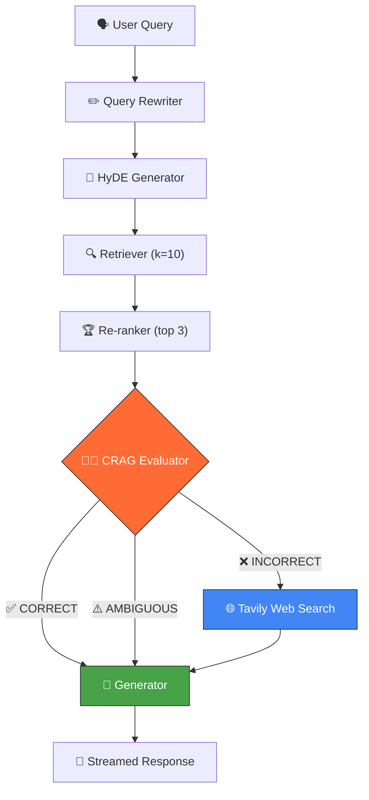

<div align="center">

  <h1>Kikandai (機関台)</h1>
  <p><strong>A Corrective RAG Document Assistant powered by LangGraph</strong></p>

  <p>
    <a href="https://kikandai.vercel.app/"><b>Live Deployment</b></a> •
    <a href="#-tech-stack">Tech Stack</a> •
    <a href="#-key-features">Features</a> •
    <a href="#-getting-started">Getting Started</a> •
    <a href="DESIGN.md"><b>System Design</b></a>
  </p>

  
  
  
  
  

</div>

<br/>

## ⚡ Overview

Kikandai is an intelligent **Corrective Retrieval-Augmented Generation (CRAG)** application that lets users upload documents and chat with them. Unlike traditional RAG systems that blindly trust retrieved chunks, Kikandai implements a **7-node LangGraph state machine** that actively evaluates retrieval quality and self-corrects by falling back to live web search when local documents lack the answer.

> 📐 **For the full system design with flowcharts, state diagrams, and node-by-node breakdowns, see [`design.md`](design.md)**

## 🛠 Tech Stack

| Layer | Technology |
|-------|-----------|
| **Framework** | Next.js 16 (App Router, Turbopack) |
| **LLM** | Google Gemini 3 Flash (`gemini-3-flash-preview`) |
| **Embeddings** | Google Gemini (`gemini-embedding-001`, 3072 dimensions) |
| **Vector DB** | MongoDB Atlas Vector Search |
| **Orchestration** | LangGraph (`@langchain/langgraph`) State Machine |
| **Web Search** | Tavily Search API (CRAG fallback) |
| **Styling** | Tailwind CSS v4 + Lucide Icons |
| **Deployment** | Vercel Serverless |

## ✨ Key Features

- 📄 **Multi-Format Ingestion** — Drag-and-drop support for PDF, CSV, and TXT files
- 🔄 **Corrective RAG (CRAG)** — Evaluates retrieval quality and falls back to web search when documents lack the answer
- 🧠 **Query Rewriting** — Transforms conversational questions into optimized vector search queries
- 📝 **HyDE (Hypothetical Document Embeddings)** — Generates hypothetical answers to improve retrieval similarity matching
- 🏆 **LLM Re-ranking** — Gemini scores and re-orders 10 retrieved chunks down to the top 3 most relevant
- 🌐 **Tavily Web Fallback** — Automatically searches the live internet when local docs cannot answer the query
- 💬 **Dual-State Memory** — Separates visual UI history from active LLM context for smarter conversations
- ⚡ **Live Streaming** — Real-time word-by-word response streaming via Web Streams API
- 🔍 **Cross-Document Search** — Semantic retrieval across all uploaded documents simultaneously
- 🎨 **Premium UI** — Dark-mode first, glassmorphism-inspired design with smooth animations

## 🏗️ Architecture



### Pipeline Nodes

| Node | File | Purpose |
|------|------|---------|
| **Query Rewriter** | `nodes/queryRewriter.ts` | Converts conversational input into keyword-rich search queries |
| **HyDE Generator** | `nodes/hydeGenerator.ts` | Creates hypothetical answers for better embedding similarity |
| **Retriever** | `nodes/retriever.ts` | MongoDB Atlas Vector Search with document ID filtering |
| **Re-ranker** | `nodes/reranker.ts` | Gemini structured output scores chunks 1-10, keeps top 3 |
| **Evaluator** | `nodes/evaluator.ts` | CRAG judge: grades context as CORRECT / INCORRECT / AMBIGUOUS |
| **Fallback Search** | `nodes/fallbackSearch.ts` | Tavily API web search (only runs when evaluator says INCORRECT) |
| **Generator** | `nodes/generator.ts` | Final Gemini response with dynamic system prompt |

## 🚀 Getting Started

### Prerequisites
- Node.js 18+
- [MongoDB Atlas](https://www.mongodb.com/products/platform/atlas-vector-search) cluster with Vector Search index
- [Google Gemini API Key](https://aistudio.google.com/)
- [Tavily API Key](https://tavily.com/) (free tier: 1,000 searches/month)

### Setup

```bash
git clone https://github.com/Bish311/Kikandai.git
cd kikandai
npm install
```

Create `.env.local`:
```env
GOOGLE_API_KEY=your_google_gemini_api_key
MONGODB_URI=your_mongodb_atlas_connection_string
MONGODB_DB_NAME=kikandai
TAVILY_API_KEY=your_tavily_api_key
```

```bash
npm run dev
```

Open [http://localhost:3000](http://localhost:3000) to start chatting with your documents.

## ☁️ Deployment

Kikandai is optimized for **Vercel Serverless** deployment.

### Steps

1. **Import Repository:** Go to [vercel.com/new](https://vercel.com/new) and import the `Bish311/Kikandai` GitHub repository.

2. **Configure Environment Variables:** In your Vercel project dashboard, navigate to **Settings → Environment Variables** and add all four keys:

   | Variable | Value |
   |----------|-------|
   | `GOOGLE_API_KEY` | Your Gemini API key |
   | `MONGODB_URI` | Your MongoDB Atlas connection string |
   | `MONGODB_DB_NAME` | `kikandai` |
   | `TAVILY_API_KEY` | Your Tavily API key |

3. **Deploy:** Vercel will automatically build and deploy on every push to `master`.

### Production Notes

- Each API route exports `maxDuration = 60` to accommodate the 7-node LangGraph pipeline within Vercel's serverless timeout.
- `next.config.ts` marks `pdf-parse` as a `serverExternalPackages` entry for proper serverless bundling.
- The LangGraph state machine compiles fresh per request, ensuring stateless serverless compatibility.
- Tavily web search fallback requires a valid `TAVILY_API_KEY` in production; without it, the fallback node gracefully returns empty results.

## 📐 System Design

The full technical design document is available at **[`DESIGN.md`](DESIGN.md)**. It includes:
- Mermaid flowcharts of the complete CRAG pipeline
- State machine diagrams showing conditional routing logic
- Sequence diagrams for document ingestion
- Node-by-node breakdown with rationale
- Configuration reference and performance considerations

## 🌐 Live Deployment

Kikandai is live and publicly accessible:

<div align="center">
  <h3><a href="https://kikandai.vercel.app/">🔗 kikandai.vercel.app</a></h3>
</div>

---

<div align="center">
  <sub>Built by <strong>Bishwayan Chatterjee</strong></sub>
</div>
